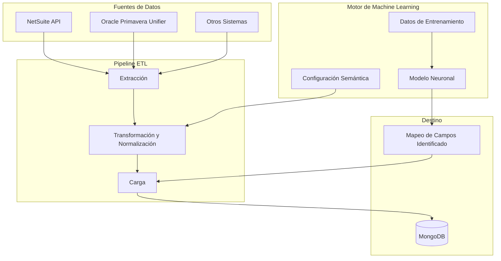
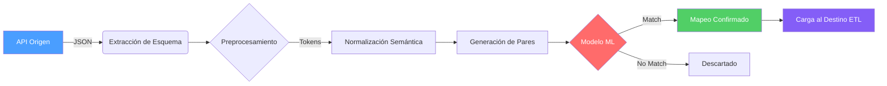
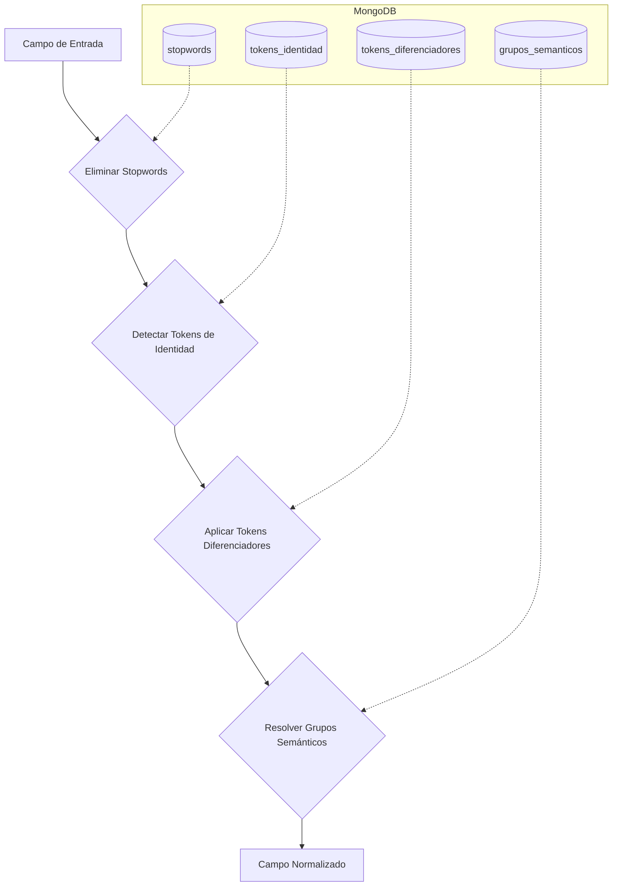
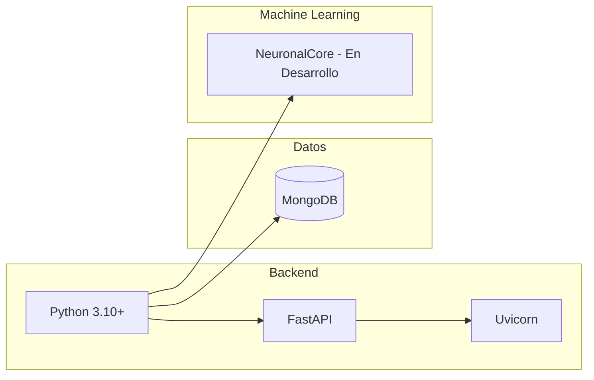
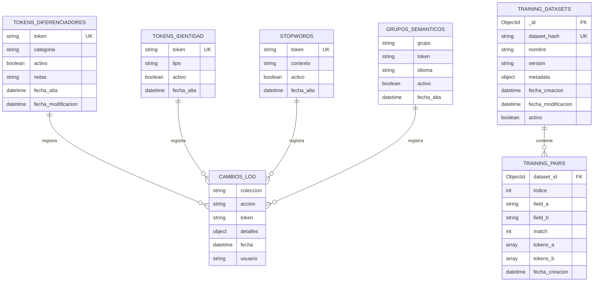
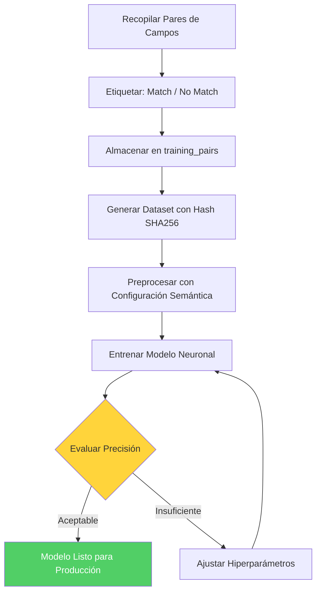

# ETL - Machine Learning (Schema Matching)

Sistema ETL (Extract, Transform, Load) que utiliza Machine Learning para realizar matching inteligente de esquemas entre diferentes plataformas empresariales, como **NetSuite** y **Oracle Primavera Unifier**. El objetivo principal es identificar y emparejar automáticamente campos equivalentes entre sistemas heterogéneos mediante análisis semántico y redes neuronales.

---

## Tabla de Contenidos

- [Descripción General](#descripción-general)
- [Arquitectura General](#arquitectura-general)
- [Pipeline ETL](#pipeline-etl)
- [Tecnologías](#tecnologías)
- [Requisitos Previos](#requisitos-previos)
- [Instalación](#instalación)
- [Estructura de la Base de Datos MongoDB](#estructura-de-la-base-de-datos-mongodb)
- [Modelo de Entrenamiento](#modelo-de-entrenamiento)
- [Contribuir](#contribuir)
- [Licencia](#licencia)

---

## Descripción General

En integraciones empresariales es habitual necesitar mapear campos entre dos sistemas que usan nombres, estructuras y convenciones diferentes. Este proyecto automatiza ese proceso mediante:

1. **Configuración semántica** — Gestiona tokens diferenciadores, tokens de identidad, stopwords y grupos semánticos en MongoDB para preprocesar los nombres de campos.
2. **Entrenamiento de modelos ML** — Almacena pares de campos etiquetados (match / no match) para entrenar modelos de matching.
3. **Core Neuronal** *(en desarrollo)* — Módulo de redes neuronales para realizar la predicción de equivalencia entre campos.

---

## Arquitectura General



---

## Pipeline ETL

El flujo completo del proceso ETL se representa a continuación:



### Detalle del Preprocesamiento



---

## Tecnologías



| Componente         | Tecnología                                        |
|--------------------|---------------------------------------------------|
| Lenguaje           | Python 3.10+                                      |
| Framework API      | [FastAPI](https://fastapi.tiangolo.com/)           |
| Base de Datos      | [MongoDB](https://www.mongodb.com/)                |
| Machine Learning   | En desarrollo (NeuronalCore)                       |
| Servidor ASGI      | [Uvicorn](https://www.uvicorn.org/)                |

---

## Requisitos Previos

- **Python** 3.10 o superior
- **MongoDB** en ejecución (local o remoto)
- **pip** (gestor de paquetes de Python)

---

## Instalación

1. **Clonar el repositorio:**

   ```bash
   git clone https://github.com/ByAncort/ETL-MachingLearning.git
   cd ETL-MachingLearning
   ```

2. **Crear un entorno virtual (recomendado):**

   ```bash
   python -m venv venv
   source venv/bin/activate        # Linux / macOS
   # venv\Scripts\activate         # Windows
   ```

3. **Instalar dependencias:**

   ```bash
   pip install fastapi uvicorn pymongo
   ```

4. **Configurar MongoDB:**

   Asegúrate de tener una instancia de MongoDB corriendo. Por defecto, la configuración espera una conexión en `localhost:27017`.

---

## Estructura de la Base de Datos MongoDB

La clase `SemanticConfigMongoDb` define la arquitectura de base de datos para almacenar configuraciones semánticas y datos de entrenamiento.

### Modelo Entidad-Relación



### Colecciones de Configuración Semántica

Almacenan tokens clasificados para análisis semántico y preprocesamiento de texto.

| Colección                | Propósito                                   | Índice Principal                        |
|--------------------------|---------------------------------------------|-----------------------------------------|
| `tokens_diferenciadores` | Tokens que discriminan entre conceptos      | `token` (único)                         |
| `tokens_identidad`       | Tokens de identificadores únicos (RFC, CURP) | `token` (único)                         |
| `stopwords`              | Palabras eliminadas en preprocesamiento     | `token` (único)                         |
| `grupos_semanticos`      | Agrupación semántica de tokens              | `(grupo, token, idioma)` único, `token` |
| `cambios_log`            | Auditoría de cambios                        | (ninguno)                               |

### Colecciones de Datos de Entrenamiento

| Colección           | Propósito                                      | Índices Principales                                               |
|---------------------|-------------------------------------------------|-------------------------------------------------------------------|
| `training_datasets` | Metadatos de datasets (hash SHA256, versión)   | `dataset_hash` único, `fecha_creacion`, `version`                 |
| `training_pairs`    | Pares de campos con etiqueta match (1) o no (0) | `(dataset_id, field_a, field_b)` único, `(dataset_id, match)`     |

---

## Modelo de Entrenamiento

El flujo de entrenamiento del modelo de matching sigue el siguiente proceso:



**Características clave:**

- **Caché en memoria** para acceso rápido a tokens activos sin consultas repetidas a MongoDB.
- **Índices únicos** que previenen duplicados en tokens y grupos semánticos.
- **Inserciones en lotes** de 1000 registros para `training_pairs`.
- **Hash SHA256** para identificar datasets y evitar duplicados automáticamente.
- **Log de auditoría** en `cambios_log` para rastrear modificaciones.

---

## Contribuir

1. Haz un fork del repositorio.
2. Crea una rama para tu feature: `git checkout -b feature/nueva-funcionalidad`
3. Realiza tus cambios y haz commit: `git commit -m "Agregar nueva funcionalidad"`
4. Sube tu rama: `git push origin feature/nueva-funcionalidad`
5. Abre un Pull Request.

---

## Licencia

Este proyecto no tiene una licencia definida actualmente. Contacta al autor para más información.
